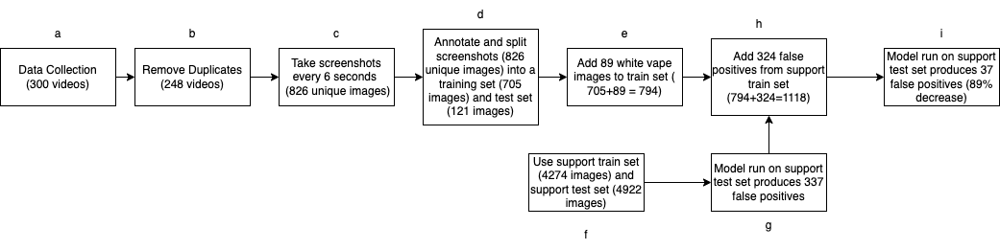

# Vape-Detection
Made as a part of the Computational Media Lab

## Process
The following diagram is a nutshell of our evaluation procedure. Corresponding datasets and scripts are attached in this repository with more detailed instructions below.

## Data Collection

We collected data over several days using the [scraper here](https://github.com/drawrowfly/tiktok-scraper). This is shown in step a,b of the above figure.

## Data Preparation

### Taking screenshots

As shown in the paper and the figure above, we get 300 total videos from which we take screenshots. This is shown in step c of the above figure. I have another repository where I maintain some helper codes, you can find code to take screenshots [there](https://github.com/tanviaanand/TikTok-Helper-Codes).

### Annotation
We used labelIMG, an open source library, to create image annotations (step d), AKA draw bounding boxes around the objects of interest (in our case: vape, hand, smoke). Detailed download and usage instructions can be found [here](https://github.com/heartexlabs/labelImg). A human being will have to carry this step out!

### YOLO Requirements
Create the corresponding annotations of your training and validations set in the YOLO format.

Images must be stored in yolov7/data/train/images
Annotations must be stored in yolov7/data/train/labels

## Code

### Training

We used the YOLOv7 implementation given [here](https://github.com/WongKinYiu/yolov7). You can clone the repository for your specific use, or use it from our [yolov7](yolov7) folder. All library requirements are mentioned here [here](https://github.com/WongKinYiu/yolov7).

The following files are used for custom implementation:

1. **yolov7/data/custom_hyperparameters.yaml**: This file is used to set hyperparameters and data augmentation settings.
2. **yolov7/data/custom_data.yaml**: Mention the location of train and validation folder  as follows
`train: ./data/train 
val: ./data/val
nc: 3  # number of classes
names: [ 'hand','smoke','vape' ]  # names of classes you are using` 
3. **cfg/training/yolov7_custom.yaml**: Download the model weights given in the  repo to your local system

### Commands

We used the following commands to train the model (steps f,g,h,i):
`!python detect.py --weights runs/train/yoloV7_3_2/weights/best.pt --conf 0.6 --img-size 640 --source ./data/val/images --name Run_inference`

### Inference

Next, inference is done using the following command (run this on the terminal of your choice):
`!python train_.py --device 0 --batch-size 16 -- data data/custom.yaml --img 640 640 --cfg cfg/training/yolov7_custom.yaml --weights yolov7_training.pt --name yoloV7_3_ --hyp data/yoloV7_pe2.yaml --epochs 300 --freeze 50`

You will find the weights of the model on yolov7/runs/train/model_1 

You can now use these weights to run inference as follows (run this on the terminal of your choice): 

`!python detect.py --weights runs/train/yoloV7_3_2/weights/best.pt --conf 0.6 --img-size 640 --source ./data/val/images --name inference1`

### Google Colab Implementation
Alternatively, if you'd like to use python notebooks to make your life easier, you can find the training implemented in [notebooks/resource-allocator-1.ipynb](notebooks/resource-allocator-1.ipynb) and inference done from [notebooks/run-inference.ipynb](notebooks/run-inference.ipynb). 

If you'd like to run inference or train on your own model and dataset, you can simply change the file paths in the commands. (step f,g,h,i)

Thank you for referring to our project and feel free to open issues in case of any questions!
